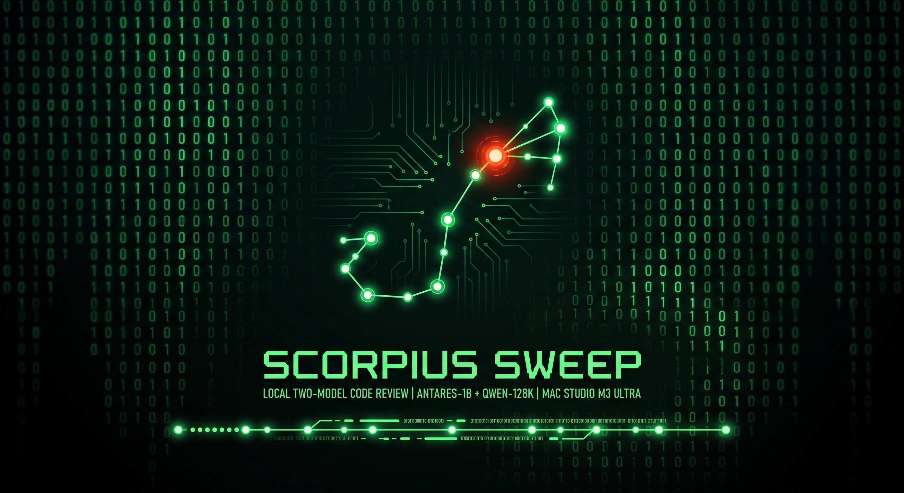

# Scorpius Sweep

A local, two-model verification harness for Cisco's Antares-1B using Ollama and Cline.

## Purpose

Scorpius Sweep exists to help test Antares. It gives you a reproducible way to run Antares-1B on
your own machine against a repository you choose, and to measure what it finds, what it misses,
and what a second model makes of its output.

Antares-1B is a small model from Cisco Foundation AI that locates vulnerable files in a repository
by running shell commands. It is not a chat model and cannot drive Cline. Scorpius Sweep runs it
behind a loop that reproduces Cisco's benchmark protocol, executes its commands in a sandbox with
no network, and sweeps the repository for the CWE classes the official Antares CLI plans for it, or
for every class in the benchmark. Each class is asked five times. Control queries with no real
class are asked thirty times, and a file counts for a class only when the class names it at a
higher rate than the controls do. A second, general model in Cline then reads
the files and confirms or dismisses each lead.

## What it is not

It is not a vulnerability scanner and should not be used as one.

- The second model can invent the code it quotes. One run produced 14 confirmed findings and none
  of its 18 quotes were in the repository. `verify_report.py` catches that, and nothing else.
- A clean result does not mean the code is clean. In the worked example the two-model pipeline,
  run without hints, confirmed one finding and dismissed four weaknesses that were in files it read.
- The localizer's precision is low. Cisco reports a File F1 of 0.209 for Antares-1B on its own
  benchmark.
- The model names files even for a class that does not exist. In the worked example it submitted
  files in 30 of 30 control runs. Those answers were scattered, with no file in more than 4 of 30.
- The 145 CWE classes in the catalog are the ones Cisco's benchmark evaluates. Which classes the
  model was trained on is not published.
- All results so far come from one TypeScript target on one machine.
- Every lead needs a person to verify it.

`RUNBOOK.md` is the full procedure, with results from a worked example. This page is the map.

## Run it

```
./setup.sh <git-url> [commit-or-ref]            # once per machine; or a path to a local checkout
./run_review.sh --device cpu                    # sweep the recorded target
./run_review.sh <git-url-or-path> --device cpu  # sweep a different target
```

Then start Cline in this folder and send the task in section 9 of the runbook. When it finishes,
run `python3 verify_report.py` to check that the code it quoted exists.

## Requirements

Python 3.9 or newer, Ollama, Docker (required, the model's commands run only in the container),
and the Antares-1B weights converted to GGUF and registered in
Ollama as `antares-1b` (runbook section 6). The weights are gated on Hugging Face and are not part
of this project.

Optional: the official Antares CLI, for `antares plan` to choose the CWE classes for a target. It
ships in the `assets` folder of the Antares-1B model repository. Without it the kit sweeps all 145
benchmark classes, and `./run_review.sh --all` does the same when it is installed.

## Layout

| Path | Purpose |
|---|---|
| `antares_locate.py` | The agent loop. Builds the prompt, talks to Ollama, runs the model's commands in a sandbox, ranks files across runs. Standard library only. |
| `setup.sh` | Checks Python, Ollama and the model, fetches the target, runs the tests, builds the sandbox image, runs one smoke query. |
| `run_review.sh` | Sweeps a target and runs the controls. Takes a git URL or path, or reuses the recorded one. |
| `make_queries.py` | Turns the official CLI's `antares plan` selection, or CWE IDs you choose, into a query file. |
| `queries/all.json`, `queries/cwe-catalog.json` | All 145 CWE classes from Cisco's benchmark. The query set when no plan is available. |
| `queries/controls.json` | Six control queries: two with no class and four invented classes. Run with every sweep. |
| `score_classes.py` | Scores each class against the control runs with a rate comparison. |
| `Dockerfile` | Sandbox image: Ubuntu 24.04 with `rg` and `tree`. |
| `.clinerules/scorpius-sweep.md` | The rule the driver model follows in Cline. |
| `verify_report.py` | Checks every citation and quoted line in the driver's report against the target's source. No model involved. |
| `tests/test_harness.py` | Checks the prompt against Cisco's byte for byte, the loop against a mock Ollama server, the scoring, the report check and, when Docker is answering, the real sandbox. They guard against regressions. They do not show that the tool finds vulnerabilities. |
| `RUNBOOK.md` | Setup, protocol, weight conversion, worked example, Cline steps, safety boundaries. |
| `LICENSE`, `NOTICE` | Apache 2.0, with attribution to Cisco's benchmark harness, the Antares CLI and MITRE CWE. |
| `.gitignore` | Keeps weights, a local copy of the CLI, targets, results and target-specific query files out of a repository. |
| `assets/` | The project banner. |

## What is not in this package

- The Antares weights. They are gated on Hugging Face under their own license.
- The Antares CLI and its CWE database. The CLI is optional and installed separately.
- Any target code, results, transcripts or plans. Those are written on your machine under
  `targets/`, `results/` and `queries/<name>*.json`.

The `.gitignore` keeps all of these out of a repository if you work inside the kit folder.

## License

Apache 2.0. See `LICENSE` and `NOTICE`. The prompt, tool definitions and loop rules are adapted from
Cisco's benchmark harness, and the control-token escaping from the Antares CLI, both Apache 2.0.
Not affiliated with or endorsed by Cisco.
